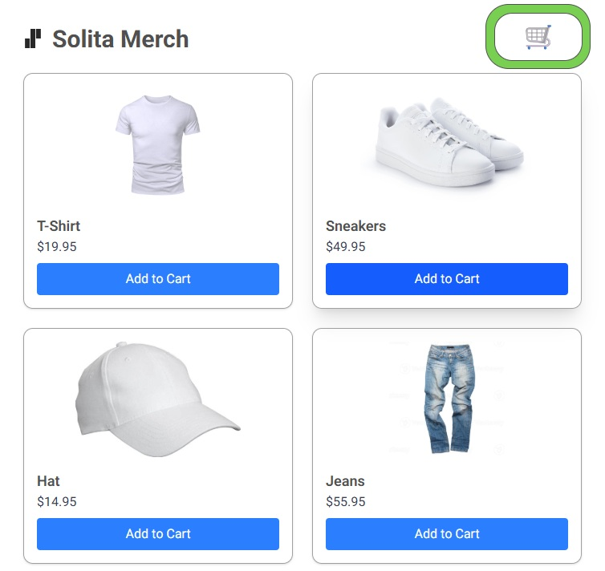

# Tiny Next.js store app

It's bad. It's ugly. It's incomplete. Run the development server:

```bash
npm install
npm run dev
```

Go to [http://localhost:3000](http://localhost:3000) to see the result.



The app mixes server-side and client-side rendering.
